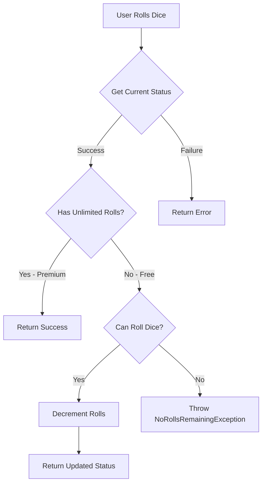

## Overview

The `RollDiceUseCase` handles dice roll attempts while enforcing subscription-based limits. Free users have a limited number of daily rolls, while premium users with the `UNLIMITED_ROLLS` entitlement can roll without restrictions.

**Package:** `com.dadomatch.shared.feature.icebreaker.domain.usecase`

## Class Definition

```kotlin
class RollDiceUseCase(
    private val subscriptionRepository: SubscriptionRepository,
    private val checkEntitlementUseCase: CheckEntitlementUseCase
) {
    suspend operator fun invoke(): Result<SubscriptionStatus>
    suspend fun resetDailyRolls()
}
```

## Constructor

<ParamField path="subscriptionRepository" type="SubscriptionRepository" required>
  Repository for managing subscription status and daily roll counts
</ParamField>

<ParamField path="checkEntitlementUseCase" type="CheckEntitlementUseCase" required>
  Use case for checking user entitlements (e.g., unlimited rolls)
</ParamField>

Creates a new instance of `RollDiceUseCase`.

**Example:**
```kotlin
val rollDiceUseCase = RollDiceUseCase(
    subscriptionRepository = subscriptionRepository,
    checkEntitlementUseCase = checkEntitlementUseCase
)
```

## Methods

### invoke (operator)

<ResponseField name="return" type="Result<SubscriptionStatus>">
  A Kotlin `Result` containing:
  - `Success<SubscriptionStatus>`: Updated subscription status with decremented rolls (for free users)
  - `Failure<NoRollsRemainingException>`: Exception when user has no rolls remaining
</ResponseField>

Attempts to perform a dice roll, checking subscription limits and decrementing the daily roll count for free users.

**Behavior:**
1. Retrieves current subscription status
2. Checks if user has unlimited rolls entitlement
3. For premium users: Returns success immediately
4. For free users: Checks remaining rolls and decrements count
5. Returns error if no rolls remaining

**Signature:**
```kotlin
suspend operator fun invoke(): Result<SubscriptionStatus>
```

**Example:**
```kotlin
val result = rollDiceUseCase()

result.onSuccess { status ->
    println("Roll successful! Remaining rolls: ${status.dailyRollsRemaining}")
    // Proceed with icebreaker generation
}.onFailure { error ->
    if (error is NoRollsRemainingException) {
        println("No rolls remaining: ${error.message}")
        // Show upgrade prompt
    } else {
        println("Error: ${error.message}")
    }
}
```

### resetDailyRolls

<ResponseField name="return" type="Unit">
  This method does not return a value
</ResponseField>

Resets the daily roll count for all users. This should be called automatically at midnight (or the start of a new day in the user's timezone).

**Signature:**
```kotlin
suspend fun resetDailyRolls()
```

**Example:**
```kotlin
// In a scheduled job or background worker
rollDiceUseCase.resetDailyRolls()
```

## Exceptions

### NoRollsRemainingException

```kotlin
class NoRollsRemainingException(message: String) : Exception(message)
```

Thrown when a free user attempts to roll the dice but has no remaining rolls for the day.

**Default Message:**
```
"You have no dice rolls remaining today. Upgrade to Premium for unlimited rolls!"
```

## Usage Examples

### Basic Roll Attempt

```kotlin
val rollDiceUseCase = RollDiceUseCase(
    subscriptionRepository = subscriptionRepo,
    checkEntitlementUseCase = checkEntitlementUseCase
)

val result = rollDiceUseCase()

when {
    result.isSuccess -> {
        val status = result.getOrNull()!!
        println("Rolls remaining: ${status.dailyRollsRemaining}")
        // Generate icebreaker
    }
    result.isFailure -> {
        val error = result.exceptionOrNull()
        if (error is NoRollsRemainingException) {
            // Show premium upgrade screen
            showUpgradePrompt()
        }
    }
}
```

### In a ViewModel

```kotlin
class IcebreakerViewModel(
    private val rollDiceUseCase: RollDiceUseCase,
    private val generateUseCase: GenerateIcebreakerUseCase
) : ViewModel() {
    
    fun onRollDice(
        environment: String,
        intensity: String,
        language: String
    ) {
        viewModelScope.launch {
            // Check if user can roll
            val rollResult = rollDiceUseCase()
            
            if (rollResult.isSuccess) {
                // Generate icebreaker
                val icebreaker = generateUseCase(
                    environment = environment,
                    intensity = intensity,
                    language = language
                )
                _icebreaker.value = icebreaker
                
                // Update remaining rolls UI
                val status = rollResult.getOrNull()!!
                _rollsRemaining.value = status.dailyRollsRemaining
            } else {
                // Show error or upgrade prompt
                _showUpgradePrompt.value = true
            }
        }
    }
}
```

### With Error Handling

```kotlin
try {
    val result = rollDiceUseCase()
    
    result.fold(
        onSuccess = { status ->
            println("Success! Remaining: ${status.dailyRollsRemaining}")
            // Continue with icebreaker generation
        },
        onFailure = { error ->
            when (error) {
                is NoRollsRemainingException -> {
                    showDialog(
                        title = "No Rolls Remaining",
                        message = error.message ?: "Upgrade to continue",
                        action = "Upgrade to Premium"
                    )
                }
                else -> {
                    showError("An unexpected error occurred")
                }
            }
        }
    )
} catch (e: Exception) {
    println("Unexpected error: ${e.message}")
}
```

### Scheduling Daily Reset

```kotlin
// Using WorkManager (Android)
class ResetRollsWorker(
    context: Context,
    params: WorkerParameters,
    private val rollDiceUseCase: RollDiceUseCase
) : CoroutineWorker(context, params) {
    
    override suspend fun doWork(): Result {
        return try {
            rollDiceUseCase.resetDailyRolls()
            Result.success()
        } catch (e: Exception) {
            Result.retry()
        }
    }
}

// Schedule daily at midnight
val resetRequest = PeriodicWorkRequestBuilder<ResetRollsWorker>(
    repeatInterval = 1,
    repeatIntervalTimeUnit = TimeUnit.DAYS
).setInitialDelay(
    calculateDelayUntilMidnight(),
    TimeUnit.MILLISECONDS
).build()

WorkManager.getInstance(context).enqueue(resetRequest)
```

## Subscription Logic Flow



## Dependency Injection

### Koin Example

```kotlin
val icebreakerModule = module {
    single<SubscriptionRepository> { SubscriptionRepositoryImpl(get()) }
    factory { CheckEntitlementUseCase(get()) }
    factory { RollDiceUseCase(get(), get()) }
}
```

## Source Location

**File:** `shared/src/commonMain/kotlin/com/dadomatch/shared/feature/icebreaker/domain/usecase/RollDiceUseCase.kt`

## See Also

- [GenerateIcebreakerUseCase](/api/icebreaker/generate-usecase) - Use case for generating icebreakers after successful roll
- [IcebreakerRepository](/api/icebreaker/icebreaker-repository) - Repository for icebreaker operations