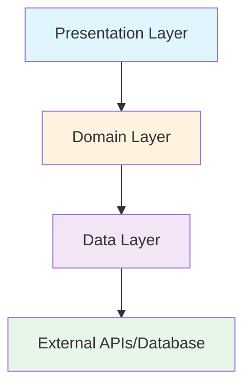

## Overview

DadoMatch Shared SDK follows **Clean Architecture** principles with a feature-based modular structure. Each feature is organized into distinct layers with clear separation of concerns, enabling testability, maintainability, and scalability across Android and iOS platforms.

## Architectural Layers

The SDK is structured in three main layers:

<CardGroup cols={3}>
  <Card title="Presentation" icon="desktop">
    UI components, ViewModels, and screen composables
  </Card>
  <Card title="Domain" icon="brain">
    Business logic, use cases, and repository interfaces
  </Card>
  <Card title="Data" icon="database">
    Repository implementations, data sources, and APIs
  </Card>
</CardGroup>

### Layer Responsibilities

<AccordionGroup>
  <Accordion title="Presentation Layer">
    **Location:** `feature/*/presentation/`
    
    - Jetpack Compose UI components and screens
    - ViewModels for state management
    - UI-specific logic and navigation
    - Platform-agnostic composables
    
    **Examples:**
    - `HomeScreen.kt` - Main icebreaker generation screen
    - `HomeViewModel.kt` - Manages icebreaker generation state
    - `AuthBottomSheet.kt` - Authentication UI component
  </Accordion>
  
  <Accordion title="Domain Layer">
    **Location:** `feature/*/domain/`
    
    - Use cases encapsulating business logic
    - Repository interfaces (contracts)
    - Domain models (pure Kotlin data classes)
    - Business rules and validation
    
    **Examples:**
    - `GenerateIcebreakerUseCase` - AI icebreaker generation logic
    - `CheckEntitlementUseCase` - Subscription validation
    - `IcebreakerRepository` - Data access contract
  </Accordion>
  
  <Accordion title="Data Layer">
    **Location:** `feature/*/data/`
    
    - Repository implementations
    - Remote data sources (API services)
    - Local data sources (Room DAOs, DataStore)
    - Data mappers (Entity ↔ Domain model)
    
    **Examples:**
    - `IcebreakerRepositoryImpl` - Implements domain contract
    - `GeminiService` - Gemini AI API client
    - `SuccessDao` - Room database access
  </Accordion>
</AccordionGroup>

## Feature Modules

The SDK is organized into self-contained feature modules, each with its own complete architecture stack:

<CodeGroup>
```kotlin Feature Module Structure
feature/
├── auth/              # Authentication & user management
│   ├── data/
│   │   └── repository/
│   ├── domain/
│   │   └── repository/
│   ├── presentation/
│   │   ├── ui/
│   │   └── viewmodel/
│   └── di/
│       └── AuthModule.kt
│
├── icebreaker/        # AI icebreaker generation
│   ├── data/
│   │   ├── remote/
│   │   └── repository/
│   ├── domain/
│   │   ├── model/
│   │   ├── repository/
│   │   └── usecase/
│   ├── presentation/
│   │   ├── ui/
│   │   └── viewmodel/
│   └── di/
│       └── IcebreakerModule.kt
│
├── subscription/       # In-app purchases & entitlements
│   ├── data/
│   │   ├── local/
│   │   ├── remote/
│   │   ├── mapper/
│   │   └── repository/
│   ├── domain/
│   │   ├── model/
│   │   ├── repository/
│   │   └── usecase/
│   ├── presentation/
│   │   └── ui/
│   └── di/
│       └── SubscriptionModule.kt
│
├── success/           # Success tracking & history
├── onboarding/        # User onboarding flow
└── core/              # Shared infrastructure
    ├── data/          # Database, DataStore
    ├── config/        # Environment config
    └── di/            # Core DI module
```
</CodeGroup>

### Feature Modules Overview

| Feature | Purpose | Key Components |
|---------|---------|----------------|
| **auth** | Firebase authentication, Google Sign-In | `AuthRepository`, `AuthViewModel`, `NativeAuthHandler` |
| **icebreaker** | AI-powered icebreaker generation using Gemini | `GeminiService`, `GenerateIcebreakerUseCase`, `HomeViewModel` |
| **subscription** | RevenueCat subscriptions & entitlements | `RevenueCatService`, `CheckEntitlementUseCase`, `SubscriptionViewModel` |
| **success** | Track and display user success records | `SuccessDao`, `AddSuccessUseCase`, `SuccessesViewModel` |
| **onboarding** | First-time user experience flow | `PreferenceRepository`, `OnboardingScreen` |
| **core** | Shared infrastructure (DB, DataStore) | `AppDatabase`, `CoreModule` |

## Dependency Flow

The architecture enforces unidirectional dependency flow:



<Note>
  **Key Principle:** Inner layers (Domain) never depend on outer layers (Presentation, Data). This ensures:
  - Business logic is platform-agnostic
  - Easy testing with mocks
  - Flexibility to swap implementations
</Note>

## Data Flow Example

Here's how data flows through the architecture when generating an icebreaker:

<Steps>
  <Step title="User Interaction">
    User taps "Generate" button in `HomeScreen.kt`
  </Step>
  
  <Step title="ViewModel Action">
    `HomeViewModel` calls `generateIcebreakerUseCase.invoke()`
  </Step>
  
  <Step title="Use Case Logic">
    `GenerateIcebreakerUseCase` applies business rules and calls repository
  </Step>
  
  <Step title="Repository Implementation">
    `IcebreakerRepositoryImpl` delegates to `GeminiService`
  </Step>
  
  <Step title="API Call">
    `GeminiService` makes HTTP request to Gemini AI API
  </Step>
  
  <Step title="Response Processing">
    Data flows back through layers, mapped at each boundary
  </Step>
  
  <Step title="UI Update">
    ViewModel updates state, UI recomposes with new icebreaker
  </Step>
</Steps>

## Core Infrastructure

Shared infrastructure is provided by the `core` module:

<CodeGroup>
```kotlin CoreModule.kt
val coreModule = module {
    // Room Database with bundled SQLite driver
    single { 
        getDatabaseBuilder()
            .setDriver(BundledSQLiteDriver())
            .build()
    }
    
    // DataStore for key-value storage
    single { createDataStore() }
}
```
</CodeGroup>

### Core Components

- **AppDatabase** - Room database with platform-specific builders
- **DataStore** - Preferences storage for settings and flags
- **EnvironmentConfig** - BuildKonfig-based configuration (see [Environment Configuration](/concepts/environment-config))
- **Platform Module** - Platform-specific implementations via `expect`/`actual`

## Platform Abstraction

The SDK uses Kotlin Multiplatform's `expect`/`actual` mechanism for platform-specific code:

<CodeGroup>
```kotlin AppModule.kt (Common)
fun getAllModules() = listOf(
    platformModule(),  // Platform-specific module
    coreModule,
    authModule,
    icebreakerModule,
    successModule,
    subscriptionModule,
    onboardingModule
)

expect fun platformModule(): Module
```

```kotlin androidMain
actual fun platformModule() = module {
    // Android-specific dependencies
    single { /* Android context, services */ }
}
```

```kotlin iosMain
actual fun platformModule() = module {
    // iOS-specific dependencies
    single { /* iOS platform services */ }
}
```
</CodeGroup>

## Best Practices

<AccordionGroup>
  <Accordion title="Use Cases">
    - Each use case should have a single responsibility
    - Name use cases with action verbs: `GenerateIcebreakerUseCase`, `CheckEntitlementUseCase`
    - Keep use cases testable by injecting dependencies
    - Return domain models, never data layer entities
  </Accordion>
  
  <Accordion title="Repository Pattern">
    - Define repository interfaces in the domain layer
    - Implement repositories in the data layer
    - Repositories coordinate between multiple data sources
    - Use mappers to convert entities to domain models
  </Accordion>
  
  <Accordion title="ViewModels">
    - ViewModels should only depend on use cases, never repositories directly
    - Use Kotlin StateFlow for reactive state management
    - Keep ViewModels platform-agnostic (no Android/iOS imports)
    - Inject ViewModels via Koin's `viewModelOf` DSL
  </Accordion>
  
  <Accordion title="Dependency Injection">
    - Each feature module declares its own DI module in `di/` directory
    - Use Koin's type-safe DSL: `singleOf`, `factoryOf`, `viewModelOf`
    - Bind interfaces to implementations: `bind RepositoryInterface::class`
    - See [Dependency Injection](/concepts/dependency-injection) for details
  </Accordion>
</AccordionGroup>

## Next Steps

<CardGroup cols={2}>
  <Card title="Dependency Injection" icon="link" href="/concepts/dependency-injection">
    Learn about Koin DI setup and module configuration
  </Card>
  <Card title="Environment Config" icon="gear" href="/concepts/environment-config">
    Understand BuildKonfig and environment management
  </Card>
</CardGroup>
