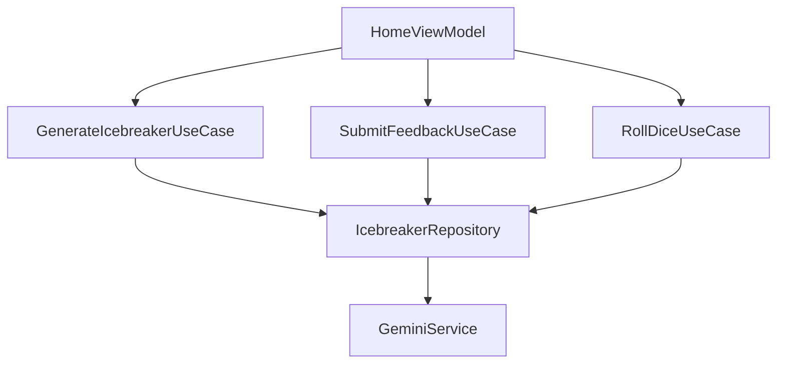

## Overview

DadoMatch Shared SDK uses [Koin](https://insert-koin.io/) for dependency injection, providing a lightweight, Kotlin-first DI solution that works seamlessly across Android and iOS platforms.

<Info>
  Koin is a pragmatic DI framework that uses Kotlin DSL for simple, type-safe dependency declarations without code generation or reflection.
</Info>

## Initialization

Koin is initialized once at app startup via the `initKoin()` function:

<CodeGroup>
```kotlin KoinInitializer.kt
fun initKoin(appDeclaration: KoinAppDeclaration = {}) {
    if (KoinPlatformTools.defaultContext().getOrNull() == null) {
        startKoin {
            appDeclaration()
            modules(getAllModules())
        }

        // Initialize RevenueCat after Koin is started
        val koin = KoinPlatformTools.defaultContext().get()
        val revenueCatService = koin.get<RevenueCatService>()
        revenueCatService.configure(BuildKonfig.REVENUECAT_API_KEY)

        // Sync logged-in user with RevenueCat
        CoroutineScope(Dispatchers.Default).launch {
            try {
                val currentUser = Firebase.auth.currentUser
                if (currentUser != null && !currentUser.isAnonymous) {
                    revenueCatService.logIn(currentUser.uid)
                }
            } catch (e: Exception) {
                // Firebase may not be ready yet — safe to ignore
            }
        }
    }
}

// iOS convenience function
fun initKoin() = initKoin {}
```

```kotlin Android (MainActivity)
class MainActivity : ComponentActivity() {
    override fun onCreate(savedInstanceState: Bundle?) {
        super.onCreate(savedInstanceState)
        
        initKoin {
            androidContext(this@MainActivity)
        }
        
        // Rest of setup...
    }
}
```

```swift iOS (AppDelegate)
import DadoMatchShared

@main
class AppDelegate: UIResponder, UIApplicationDelegate {
    func application(
        _ application: UIApplication,
        didFinishLaunchingWithOptions launchOptions: [UIApplication.LaunchOptionsKey: Any]?
    ) -> Bool {
        KoinInitializerKt.initKoin()
        return true
    }
}
```
</CodeGroup>

<Warning>
  Always call `initKoin()` before accessing any dependencies. The function includes a safety check to prevent double initialization.
</Warning>

## Module Structure

All Koin modules are collected in `AppModule.kt`:

<CodeGroup>
```kotlin AppModule.kt
fun getAllModules() = listOf(
    platformModule(),      // Platform-specific (Android/iOS)
    coreModule,           // Database, DataStore
    authModule,           // Authentication
    icebreakerModule,     // AI icebreaker generation
    successModule,        // Success tracking
    subscriptionModule,   // In-app purchases
    onboardingModule      // Onboarding flow
)

expect fun platformModule(): Module
```
</CodeGroup>

Each feature module is defined in its own `di/` directory:

```
feature/
├── auth/di/AuthModule.kt
├── icebreaker/di/IcebreakerModule.kt
├── subscription/di/SubscriptionModule.kt
├── success/di/SuccessModule.kt
└── onboarding/di/OnboardingModule.kt
```

## Module Definitions

### Core Module

Provides shared infrastructure (database, DataStore):

<CodeGroup>
```kotlin CoreModule.kt
val coreModule = module {
    // Room Database
    single { 
        getDatabaseBuilder()
            .setDriver(BundledSQLiteDriver())
            .build()
    }
    
    // DataStore for preferences
    single { createDataStore() }
}
```
</CodeGroup>

**Key Dependencies:**
- `AppDatabase` - Room database instance (singleton)
- `DataStore<Preferences>` - Key-value storage (singleton)

### Auth Module

Handles Firebase authentication:

<CodeGroup>
```kotlin AuthModule.kt
val authModule = module {
    singleOf(::AuthRepositoryImpl) bind AuthRepository::class
    viewModelOf(::AuthViewModel)
}
```
</CodeGroup>

**Dependency Graph:**
- `AuthRepositoryImpl` → `AuthRepository` (singleton)
- `AuthViewModel` → `AuthRepository`

### Icebreaker Module

Manages AI icebreaker generation with Gemini:

<CodeGroup>
```kotlin IcebreakerModule.kt
val icebreakerModule = module {
    single { 
        GeminiService(
            apiKey = BuildKonfig.GEMINI_API_KEY,
            modelName = BuildKonfig.GEMINI_MODEL_NAME
        ) 
    }
    singleOf(::IcebreakerRepositoryImpl) bind IcebreakerRepository::class
    
    // Use cases
    factoryOf(::GenerateIcebreakerUseCase)
    factoryOf(::SubmitFeedbackUseCase)
    factoryOf(::RollDiceUseCase)
    
    viewModelOf(::HomeViewModel)
}
```
</CodeGroup>

**Dependency Graph:**


### Subscription Module

Handles RevenueCat subscriptions and entitlements:

<CodeGroup>
```kotlin SubscriptionModule.kt
val subscriptionModule = module {
    single { RevenueCatService() }
    single { SubscriptionLocalDataSource(get()) }
    singleOf(::SubscriptionRepositoryImpl) bind SubscriptionRepository::class
    
    // Use cases
    factoryOf(::GetSubscriptionStatusUseCase)
    factoryOf(::CheckEntitlementUseCase)
    factoryOf(::PurchaseSubscriptionUseCase)
    factoryOf(::RestorePurchasesUseCase)
    factoryOf(::GetAvailableProductsUseCase)
    
    viewModelOf(::SubscriptionViewModel)
}
```
</CodeGroup>

**Key Dependencies:**
- `RevenueCatService` - RevenueCat SDK wrapper (singleton)
- `SubscriptionLocalDataSource` - DataStore cache (singleton)
- `SubscriptionRepositoryImpl` - Combines remote + local sources

### Success Module

Tracks user success records with Room:

<CodeGroup>
```kotlin SuccessModule.kt
val successModule = module {
    single { get<AppDatabase>().successDao() }
    singleOf(::SuccessRepositoryImpl) bind SuccessRepository::class
    
    factoryOf(::AddSuccessUseCase)
    factoryOf(::GetSuccessesUseCase)
    
    factory { 
        SuccessesViewModel(
            getSuccessesUseCase = get(),
            checkEntitlementUseCase = get()  // Cross-module dependency
        ) 
    }
}
```
</CodeGroup>

<Note>
  Notice `SuccessesViewModel` depends on `CheckEntitlementUseCase` from the subscription module. Koin automatically resolves cross-module dependencies.
</Note>

### Onboarding Module

Manages first-time user experience:

<CodeGroup>
```kotlin OnboardingModule.kt
val onboardingModule = module {
    singleOf(::PreferenceRepositoryImpl) bind PreferenceRepository::class
    factoryOf(::GetOnboardingStatusUseCase)
    factoryOf(::SetOnboardingStatusUseCase)
}
```
</CodeGroup>

## Koin DSL Functions

The SDK uses Koin's type-safe DSL for concise dependency declarations:

<AccordionGroup>
  <Accordion title="singleOf - Singleton with Constructor Injection">
    Creates a singleton instance, automatically injecting constructor parameters:
    
    ```kotlin
    singleOf(::AuthRepositoryImpl) bind AuthRepository::class
    ```
    
    Equivalent to:
    ```kotlin
    single<AuthRepository> { AuthRepositoryImpl() }
    ```
    
    **When to use:** Repositories, services that should exist only once
  </Accordion>
  
  <Accordion title="factoryOf - Factory with Constructor Injection">
    Creates a new instance every time it's requested:
    
    ```kotlin
    factoryOf(::GenerateIcebreakerUseCase)
    ```
    
    Equivalent to:
    ```kotlin
    factory { GenerateIcebreakerUseCase(get()) }
    ```
    
    **When to use:** Use cases, short-lived objects
  </Accordion>
  
  <Accordion title="viewModelOf - ViewModel with Constructor Injection">
    Creates a ViewModel with lifecycle awareness:
    
    ```kotlin
    viewModelOf(::HomeViewModel)
    ```
    
    Equivalent to:
    ```kotlin
    viewModel { HomeViewModel(get(), get(), get()) }
    ```
    
    **When to use:** All ViewModels for UI screens
  </Accordion>
  
  <Accordion title="bind - Interface Binding">
    Binds an implementation to its interface:
    
    ```kotlin
    singleOf(::IcebreakerRepositoryImpl) bind IcebreakerRepository::class
    ```
    
    Allows injection by interface:
    ```kotlin
    class UseCase(private val repository: IcebreakerRepository)
    ```
    
    **When to use:** When following Repository pattern with interfaces
  </Accordion>
  
  <Accordion title="single - Custom Singleton">
    Creates a singleton with manual configuration:
    
    ```kotlin
    single { 
        GeminiService(
            apiKey = BuildKonfig.GEMINI_API_KEY,
            modelName = BuildKonfig.GEMINI_MODEL_NAME
        ) 
    }
    ```
    
    **When to use:** When constructor requires non-injected parameters (config values, etc.)
  </Accordion>
  
  <Accordion title="factory - Custom Factory">
    Creates a new instance with manual configuration:
    
    ```kotlin
    factory { 
        SuccessesViewModel(
            getSuccessesUseCase = get(),
            checkEntitlementUseCase = get()
        ) 
    }
    ```
    
    **When to use:** When you need explicit parameter control
  </Accordion>
</AccordionGroup>

## Injecting Dependencies

There are multiple ways to inject dependencies:

### Constructor Injection (Recommended)

<CodeGroup>
```kotlin Use Case
class GenerateIcebreakerUseCase(
    private val repository: IcebreakerRepository
) {
    suspend operator fun invoke(/* params */) = repository.generate(/* ... */)
}
```

```kotlin Repository Implementation
class IcebreakerRepositoryImpl(
    private val geminiService: GeminiService
) : IcebreakerRepository {
    override suspend fun generate(/* ... */) = geminiService.generateText(/* ... */)
}
```

```kotlin ViewModel
class HomeViewModel(
    private val generateIcebreakerUseCase: GenerateIcebreakerUseCase,
    private val submitFeedbackUseCase: SubmitFeedbackUseCase,
    private val rollDiceUseCase: RollDiceUseCase
) : ViewModel() {
    // ViewModel logic...
}
```
</CodeGroup>

### Composable Injection

Inject ViewModels directly in Composable functions:

<CodeGroup>
```kotlin Composable Screen
@Composable
fun HomeScreen(
    viewModel: HomeViewModel = koinViewModel()
) {
    val state by viewModel.state.collectAsState()
    
    // UI implementation...
}
```
</CodeGroup>

### Manual Retrieval (Rare)

Directly retrieve dependencies from Koin context:

<CodeGroup>
```kotlin Manual Get
val koin = KoinPlatformTools.defaultContext().get()
val repository = koin.get<IcebreakerRepository>()
```
</CodeGroup>

<Warning>
  Use manual retrieval sparingly. Constructor injection is preferred for testability and clarity.
</Warning>

## Platform-Specific Dependencies

The `platformModule()` provides platform-specific implementations:

<CodeGroup>
```kotlin androidMain
actual fun platformModule() = module {
    single<Context> { androidContext() }
    // Android-specific services
}
```

```kotlin iosMain
actual fun platformModule() = module {
    // iOS-specific services
}
```
</CodeGroup>

## Testing with Koin

Koin makes testing easy by allowing module overrides:

<CodeGroup>
```kotlin Test Setup
@Test
fun `test icebreaker generation`() = runTest {
    startKoin {
        modules(
            module {
                single<IcebreakerRepository> { 
                    MockIcebreakerRepository() 
                }
                factoryOf(::GenerateIcebreakerUseCase)
            }
        )
    }
    
    val useCase = KoinPlatformTools.defaultContext().get()
                    .get<GenerateIcebreakerUseCase>()
    
    val result = useCase(/* test params */)
    
    // Assertions...
    
    stopKoin()
}
```
</CodeGroup>

## Best Practices

<AccordionGroup>
  <Accordion title="Scope Management">
    - Use `single` for expensive objects (database, API clients)
    - Use `factory` for lightweight objects (use cases)
    - Use `viewModel` for all ViewModels to ensure proper lifecycle handling
  </Accordion>
  
  <Accordion title="Module Organization">
    - Keep one module per feature in its `di/` directory
    - Name modules descriptively: `authModule`, `icebreakerModule`
    - Document module purpose with KDoc comments
  </Accordion>
  
  <Accordion title="Dependency Resolution">
    - Prefer constructor injection over manual `get()`
    - Use `bind` to inject by interface, not implementation
    - Let Koin handle dependency graphs automatically
  </Accordion>
  
  <Accordion title="Configuration">
    - Pass configuration values (API keys) when creating singletons
    - Use BuildKonfig for environment-specific values
    - See [Environment Configuration](/concepts/environment-config)
  </Accordion>
</AccordionGroup>

## Common Patterns

### Repository with Multiple Data Sources

<CodeGroup>
```kotlin Module Definition
val subscriptionModule = module {
    single { RevenueCatService() }                    // Remote
    single { SubscriptionLocalDataSource(get()) }    // Local cache
    singleOf(::SubscriptionRepositoryImpl) bind SubscriptionRepository::class
}
```

```kotlin Repository Implementation
class SubscriptionRepositoryImpl(
    private val remoteService: RevenueCatService,
    private val localDataSource: SubscriptionLocalDataSource
) : SubscriptionRepository {
    override suspend fun getStatus(): SubscriptionStatus {
        // Try local cache first
        val cached = localDataSource.getCachedStatus()
        if (cached != null) return cached
        
        // Fetch from remote and cache
        val remote = remoteService.getCustomerInfo()
        localDataSource.cacheStatus(remote)
        return remote
    }
}
```
</CodeGroup>

### Cross-Module Dependencies

<CodeGroup>
```kotlin Success Module
val successModule = module {
    factory { 
        SuccessesViewModel(
            getSuccessesUseCase = get(),
            checkEntitlementUseCase = get()  // From subscriptionModule
        ) 
    }
}
```
</CodeGroup>

<Info>
  Koin automatically resolves dependencies across modules as long as they're all included in `getAllModules()`.
</Info>

### DAO Injection from Database

<CodeGroup>
```kotlin Success Module
val successModule = module {
    single { get<AppDatabase>().successDao() }
    singleOf(::SuccessRepositoryImpl) bind SuccessRepository::class
}
```

```kotlin Repository
class SuccessRepositoryImpl(
    private val dao: SuccessDao
) : SuccessRepository {
    override fun getAll() = dao.getAllSuccesses()
    override suspend fun add(record: SuccessRecord) = dao.insert(record.toEntity())
}
```
</CodeGroup>

## Troubleshooting

<AccordionGroup>
  <Accordion title="NoBeanDefFoundException">
    **Problem:** Dependency not found when injecting
    
    **Solution:**
    - Verify the dependency is declared in a module
    - Ensure the module is included in `getAllModules()`
    - Check constructor parameter types match module definitions
  </Accordion>
  
  <Accordion title="Double Initialization">
    **Problem:** Koin initialized multiple times
    
    **Solution:**
    - Use the safety check in `initKoin()`: `if (KoinPlatformTools.defaultContext().getOrNull() == null)`
    - Call `initKoin()` only once at app startup
  </Accordion>
  
  <Accordion title="Circular Dependencies">
    **Problem:** Two classes depend on each other
    
    **Solution:**
    - Restructure code to break the cycle
    - Introduce an interface or mediator
    - Use lazy injection: `val repo: Repository by inject()`
  </Accordion>
</AccordionGroup>

## Next Steps

<CardGroup cols={2}>
  <Card title="Architecture Overview" icon="sitemap" href="/concepts/architecture">
    Learn about clean architecture and feature modules
  </Card>
  <Card title="Environment Config" icon="gear" href="/concepts/environment-config">
    Understand BuildKonfig and environment management
  </Card>
</CardGroup>
